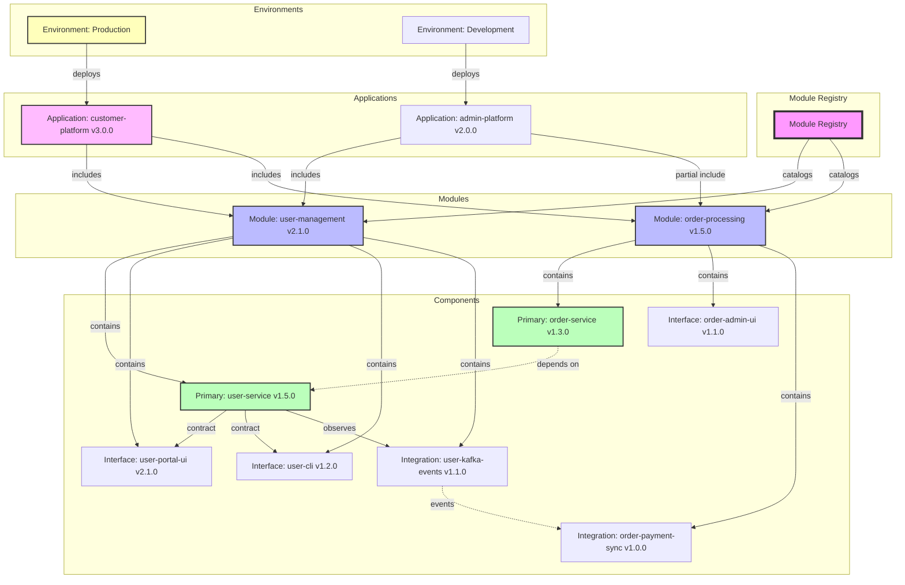

# Modular Service Meta-Architecture Overview

## Introduction

This meta-architecture defines a system for building complex applications from reusable, independently versioned components. It provides a structured approach to organizing microservices, user interfaces, and infrastructure into logical modules that can be composed into applications.

## Key Concepts

### Module
A **Module** is a logical grouping of related components that together provide a cohesive business capability. Modules are the primary unit of functional organization and represent a complete feature or service area.

**Characteristics:**
- Contains one Primary Component and zero or more Interface and Integration Components
- Has a unified version representing a compatible set of component versions
- Owned by a single team
- Provides specific business capabilities
- Defines contracts for interaction with other modules

**Examples:** user-management, order-processing, payment-system, notification-service

### Component
A **Component** is an independently deployable unit with its own repository, lifecycle, and version. Components are the atomic building blocks that implement specific aspects of a module's functionality.

**Characteristics:**
- Lives in its own repository
- Has independent versioning
- Can be deployed separately
- Contains its own deployment configurations
- Declares dependencies on other components

### Component Classifications

#### Primary Component
The core implementation of a module's business logic or infrastructure provision. Every module must have exactly one Primary Component.

**Types:**
- **Service Primary**: Microservices containing business logic
- **Infrastructure Primary**: Terraform/IaC defining cloud resources

#### Interface Component
Components that provide ways for external actors (users, systems, developers) to interact with the Primary Component.

**Types:**
- **Web UI**: Browser-based interfaces (including micro-frontends)
- **Mobile UI**: Native or hybrid mobile applications  
- **CLI**: Command-line interfaces
- **API Gateway**: GraphQL, REST aggregation layers
- **SDK**: Software development kits for various languages

#### Integration Component
Components that handle communication with external systems or implement protocol-specific integrations.

**Types:**
- **Event Publishers**: Kafka, RabbitMQ, EventBridge producers
- **Event Consumers**: Message queue consumers
- **Sync Adapters**: Direct integrations with third-party APIs
- **Protocol Bridges**: gRPC-to-REST, SOAP adapters, etc.
- **ETL Components**: Data pipeline and transformation services

### Application
An **Application** is a deployable product composed of specific versions of modules. Applications define which modules and components are deployed together to create a complete system.

**Characteristics:**
- Selects specific module versions
- Can include subset of available components
- Defines environment-specific configurations
- Represents a deployable product or system

### Module Registry
The **Module Registry** is a centralized catalog of all modules, their components, versions, and relationships. It serves as the source of truth for module discovery and dependency management.

**Contains:**
- Module definitions and metadata
- Component locations and versions
- Dependency graphs
- Team ownership information
- Contract specifications
- Compatibility matrices

### Module Contract
A **Module Contract** defines the interfaces a module provides and requires. Contracts enable loose coupling between modules.

**Elements:**
- API specifications (OpenAPI, gRPC proto, GraphQL schema)
- Event schemas
- Required dependencies
- Service level agreements (SLAs)

### Environment
An **Environment** represents a deployment target (development, staging, production) with specific configuration and component selections.

**Characteristics:**
- Selects which components to deploy
- Provides environment-specific configuration
- Defines resource allocations
- Sets scaling parameters

## Versioning Strategy

### Component Versioning
Components use semantic versioning (MAJOR.MINOR.PATCH):
- **MAJOR**: Breaking changes to interfaces or behavior
- **MINOR**: New features, backward compatible
- **PATCH**: Bug fixes, no interface changes

Each component maintains its own version independently.

### Module Versioning
Modules use semantic versioning to indicate compatible sets of components:
- **MAJOR**: Breaking changes to module contracts or major architectural changes
- **MINOR**: New components added or significant features across components
- **PATCH**: Updates to component versions within compatibility range

A module version represents a tested, compatible combination of component versions.

### Version Compatibility
- Module versions define compatibility ranges for their components
- Components declare their dependencies using version constraints
- The Module Registry maintains compatibility matrices
- Applications pin specific module versions for stability

## Relationship Model

## Architectural Benefits

1. **Clear Separation of Concerns**: Each component has a specific, well-defined purpose
2. **Independent Development**: Teams can work on components without coordinating every change
3. **Flexible Composition**: Applications can include only the components they need
4. **Technology Diversity**: Each component can use the most appropriate technology stack
5. **Versioning Clarity**: Both fine-grained (component) and coarse-grained (module) version control
6. **Scalable Organization**: Architecture supports growth from tens to hundreds of modules
7. **Explicit Dependencies**: All relationships between components are declared and versioned

This meta-architecture provides a foundation for building complex systems while maintaining clarity, flexibility, and operational independence at scale.